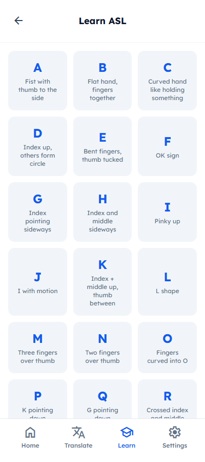
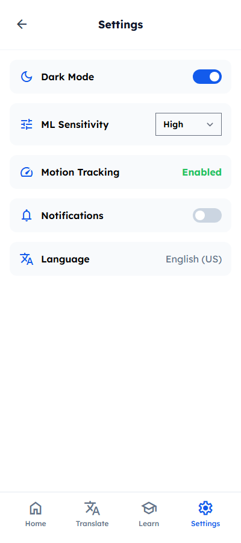
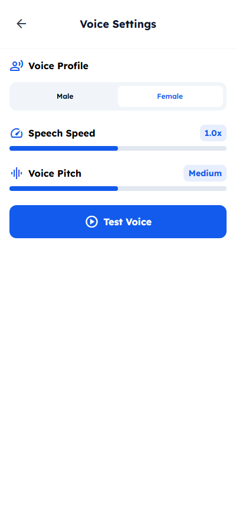
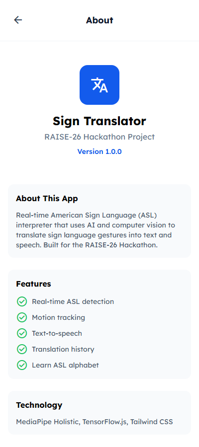
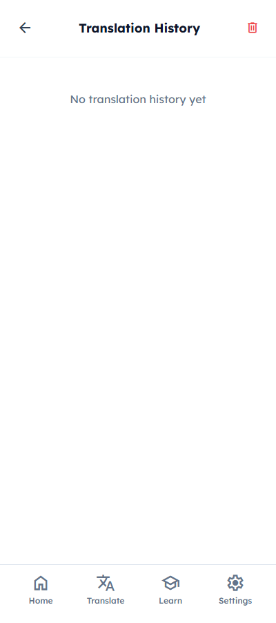

# Real-Time Sign Language Interpreter

**RAISE-26 Hackathon Project #1559029**

[](https://sign-interpreter-five.vercel.app)
[](https://github.com/dezzydez007/raise-26-sign-interpreter)

---

## Screenshots

### 1. Home Screen

Features: Quick stats, recent translations, navigation menu access

### 2. Learn ASL Screen

Features: Complete A-Z alphabet guide with finger position instructions

### 3. Settings Screen

Features: Dark mode, ML sensitivity, motion tracking, notifications

### 4. Voice Settings Screen

Features: Voice profile selection, speech speed, pitch control

### 5. About Screen

Features: App information, features list, technology stack

### 6. History Screen

Features: Translation history tracking

---

## 1. Problem Statement

Communication barriers persist between the deaf/hard-of-hearing community and hearing individuals. Approximately 430 million people worldwide have disabling hearing loss, and this number is projected to increase to over 700 million by 2050. 

Key problems include:
- **Lack of real-time translation**: Existing solutions have significant delays
- **Accessibility gaps**: Many public services, healthcare facilities, and educational institutions lack adequate sign language interpretation
- **Dependency on human interpreters**: Cost-prohibitive and not always available
- **Limited vocabulary support**: Most apps only recognize fingerspelling (A-Z) rather than full words and phrases

---

## 2. Solution

Our **Real-Time Sign Language Interpreter** is an AI-powered device that:
- Captures video input via webcam
- Uses computer vision (MediaPipe Holistic) to detect and track hand landmarks
- Employs motion detection ML to improve gesture recognition
- Classifies gestures into letters (A-Z) and common phrases
- Outputs translations as both **text** (on-screen) and **spoken audio** (text-to-speech)
- Works in real-time with minimal latency

This solution bridges communication gaps by providing instant, automatic translation without requiring a human interpreter.

---

## 3. Technical Implementation

### Architecture
```
┌─────────────────┐    ┌──────────────────┐    ┌─────────────────┐
│  Webcam Input   │───>│ MediaPipe        │───>│ Motion Detection│
│                 │    │ Holistic          │    │ & Gesture ML    │
└─────────────────┘    └──────────────────┘    └─────────────────┘
                                                      │
                                                      v
                        ┌──────────────────┐    ┌─────────────────┐
                        │   Text Display   │<───│ Text-to-Speech  │
                        │   (Browser)      │    │   (Web Speech)  │
                        └──────────────────┘    └─────────────────┘
```

### Key Components

1. **MediaPipe Holistic** - Full body/hand pose detection
2. **Motion Tracking** - Calculates velocity between frames
3. **Finger Detection** - Uses PIP joint positions for accuracy
4. **Consistency Filtering** - Requires 3+ consistent predictions
5. **Both Hands** - Supports detection for left and right hands

### Technologies Used
- **MediaPipe Holistic** - Hand landmark detection
- **TensorFlow.js** - ML processing in browser
- **Tailwind CSS** - UI styling
- **Vercel** - Deployment

---

## 4. Features

| Feature | Description |
|---------|-------------|
| Real-time Detection | Live ASL gesture recognition |
| Motion Tracking | Detects hand movement patterns |
| Text-to-Speech | Voice output of translations |
| ASL Alphabet | Complete A-Z guide |
| Translation History | Save and review past translations |
| Calibration | Improve accuracy with training |
| Dark Mode | Support for dark theme |
| Voice Settings | Customize speech output |

---

## 5. How to Run

### Live Demo
Visit: https://sign-interpreter-five.vercel.app

### Local Development
```bash
# Clone the repository
git clone https://github.com/dezzydez007/raise-26-sign-interpreter.git

# Open index.html in a browser
# Or serve with a local server
npx serve
```

---

## 6. Project Structure

```
├── index.html          # Main application (single-page app)
├── assets/
│   └── screenshots/   # App screenshots
├── UI/                # Original UI templates
├── asl_gesture_database.json  # ASL gesture reference data
├── requirements.txt   # Python dependencies
├── README.md         # This file
└── vercel.json       # Vercel deployment config
```

---

## 7. Future Enhancements

- Deep learning models for better accuracy
- Support for multiple sign languages (ASL, BSL, etc.)
- Mobile app deployment
- Integration with video conferencing platforms
- Continuous learning from user input

---

## License

MIT License - RAISE-26 Hackathon Project

---

*Submitted for RAISE-26 Hackathon | Project #1559029*
