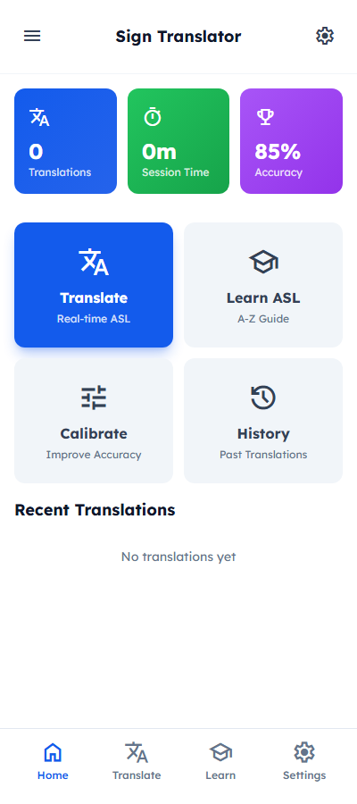
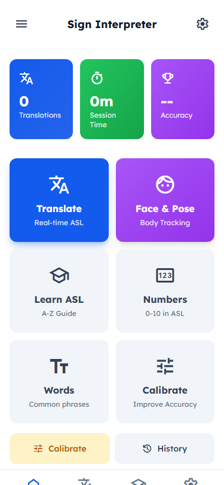

# Real-Time Sign Language Interpreter

**RAISE-26 Hackathon Project #1559029**

[](https://sign-interpreter-five.vercel.app)
[](https://github.com/dezzydez007/raise-26-sign-interpreter)

---

## Screenshots

### 1. Home Screen

Dashboard with translation stats, quick access buttons to Translate, Face & Pose, Learn ASL, Numbers, Words, and Calibrate features.

### 2. Translate Screen

Real-time ASL detection with live camera feed, motion tracking indicator, confidence display, and Speak/Copy controls.

### 3. Learn ASL Screen

Complete A-Z alphabet guide with difficulty filters (Easy/Medium/Hard) and detailed instructions for each letter.

### 4. Numbers Screen

ASL numbers 0-10 with visual demonstrations and finger position descriptions.

### 5. Common Words Screen

Essential ASL phrases organized by category: Greetings, Questions, and Everyday expressions.

### 6. Face & Pose Detection Screen

Real-time face mesh (468 points) and body pose detection (33 points) for enhanced gesture recognition.

### 7. History Screen

Translation history with export functionality and speaker buttons for each entry.

### 8. Settings Screen

Full settings panel with toggles for Dark Mode, Landmarks, Motion Tracking, Hand/Face/Pose Detection, Sound & Vibration feedback.

### 9. Voice Settings Screen

Voice profile selection (Male/Female/Neutral), speech speed, pitch, and volume controls with test functionality.

### 10. About Screen

App information, features list, technology stack, and tips for best results.

---

## 1. Problem Statement

Communication barriers persist between the deaf/hard-of-hearing community and hearing individuals. Approximately 430 million people worldwide have disabling hearing loss, and this number is projected to increase to over 700 million by 2050. 

Key problems include:
- **Lack of real-time translation**: Existing solutions have significant delays
- **Accessibility gaps**: Many public services, healthcare facilities, and educational institutions lack adequate sign language interpretation
- **Dependency on human interpreters**: Cost-prohibitive and not always available
- **Limited vocabulary support**: Most apps only recognize fingerspelling (A-Z) rather than full words and phrases

---

## 2. Solution

Our **Real-Time Sign Language Interpreter** is an AI-powered device that:
- Captures video input via webcam
- Uses computer vision (MediaPipe Holistic) to detect and track hand landmarks
- Employs motion detection ML to improve gesture recognition
- Classifies gestures into letters (A-Z), numbers (0-10), and common phrases
- Outputs translations as both **text** (on-screen) and **spoken audio** (text-to-speech)
- Provides face mesh and pose detection for enhanced understanding

---

## 3. Technical Implementation

### Architecture
```
┌─────────────────┐    ┌──────────────────┐    ┌─────────────────┐
│  Webcam Input   │───>│ MediaPipe        │───>│ Motion Detection│
│                 │    │ Holistic         │    │ & Gesture ML    │
└─────────────────┘    └──────────────────┘    └─────────────────┘
                                                      │
                                                      v
                         ┌──────────────────┐    ┌─────────────────┐
                         │   Text Display   │<───│ Text-to-Speech  │
                         │   (Browser)      │    │   (Web Speech)  │
                         └──────────────────┘    └─────────────────┘
```

### Key Components

1. **MediaPipe Holistic** - Full body, face, and hand pose detection
2. **Motion Tracking** - Calculates velocity between frames for dynamic gestures
3. **Finger Detection** - Uses PIP joint positions for accuracy
4. **Consistency Filtering** - Requires 3+ consistent predictions
5. **Both Hands** - Supports detection for left and right hands
6. **Face Mesh** - 468 facial landmarks for expression detection
7. **Pose Detection** - 33 body keypoints for signing posture

### Technologies Used
- **MediaPipe Holistic** - Hand, face, and pose landmark detection
- **TensorFlow.js** - ML processing in browser
- **Tailwind CSS** - UI styling
- **Vercel** - Deployment

---

## 4. Features

| Feature | Description |
|---------|-------------|
| Real-time Detection | Live ASL gesture recognition |
| Motion Tracking | Detects hand movement patterns |
| Face Detection | 468-point face mesh |
| Pose Detection | 33-point body pose tracking |
| Text-to-Speech | Voice output of translations |
| ASL Alphabet | Complete A-Z guide with tutorials |
| Numbers 0-10 | ASL number gestures |
| Common Words | Essential phrases by category |
| Translation History | Save and review translations |
| Calibration | Improve accuracy with training |
| Dark Mode | Support for dark theme |
| Voice Settings | Customize speech output |

---

## 5. How to Run

### Live Demo
Visit: https://sign-interpreter-five.vercel.app

### Local Development
```bash
# Clone the repository
git clone https://github.com/dezzydez007/raise-26-sign-interpreter.git

# Open index.html in a browser
# Or serve with a local server
npx serve
```

---

## 6. Project Structure

```
├── index.html          # Main application (single-page app)
├── assets/
│   └── screenshots/   # App screenshots (10 screens)
├── UI/                # Original UI templates
├── asl_gesture_database.json  # ASL gesture reference data
├── requirements.txt   # Python dependencies
├── README.md         # This file
└── vercel.json       # Vercel deployment config
```

---

## 7. Future Enhancements

- Deep learning models for better accuracy
- Support for multiple sign languages (ASL, BSL, etc.)
- Mobile app deployment
- Integration with video conferencing platforms
- Continuous learning from user input

---

## License

MIT License - RAISE-26 Hackathon Project

---

*Submitted for RAISE-26 Hackathon | Project #1559029*
